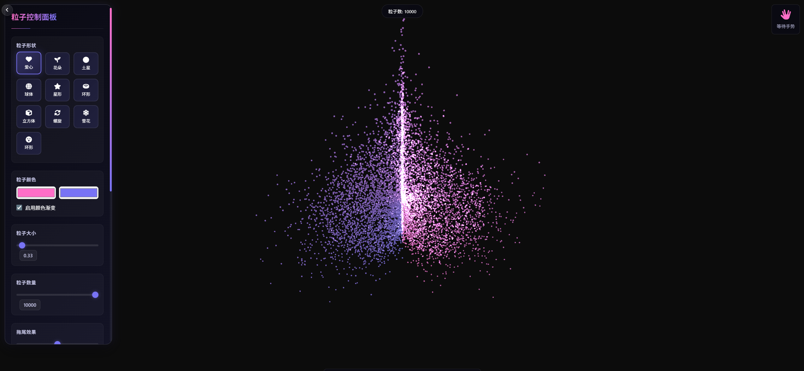

# 3D粒子交互系统（支持移动端）

一个基于Three.js的实时3D粒子交互系统，支持手势控制、音乐可视化和自定义形状。

## 🎯 功能特性



### 交互控制
- **手势控制**：通过摄像头检测双手张合控制粒子缩放与扩散
- **鼠标交互**：支持鼠标拖动旋转视角、滚轮缩放
- **形状选择**：提供多种预设形状（爱心、花朵、土星、球体、星星等）
- **自定义形状**：支持上传图片生成粒子排列

### 手势说明
1. 单手张开/握拳：控制扩散与聚合
2. 手掌左右移动：控制旋转
3. 挥手：切换粒子形状
4. 捏合：控制粒子大小
5. 双手距离：控制整体缩放
6. 比心：切换爱心特效

### 视觉效果
- **3D粒子系统**：实时渲染10000+粒子，支持形状变形
- **渐变色彩**：可自定义双色调渐变效果
- **拖尾效果**：粒子运动时产生平滑拖尾
- **内部粒子填充**：支持形状内部粒子填充

### 音乐功能
- **音乐播放**：支持选择和播放本地音乐文件
- **自动扫描**：服务器启动时自动扫描music文件夹生成播放列表
- **进度控制**：音乐播放进度条和时间显示

### 系统特性
- **响应式设计**：适配不同屏幕尺寸
- **全屏模式**：支持一键进入全屏体验
- **HTTPS支持**：确保摄像头等敏感功能正常工作
- **并发处理**：使用多线程服务器处理并发请求
- **跨域支持**：适配映射/内网穿透场景

## 🛠️ 技术栈

### 前端技术
- **Three.js r128**：3D图形渲染
- **TensorFlow.js**：机器学习框架
- **HandPoseDetection**：手势检测
- **MediaPipe Hands**：手部关键点识别
- **JavaScript (ES6+)**：前端交互逻辑
- **HTML5/CSS3**：页面结构和样式

### 后端技术
- **Python 3**：服务器端开发
- **http.server**：Web服务器
- **socketserver**：多线程支持
- **Pathlib**：文件系统操作
- **SSL/TLS**：HTTPS支持

## 📁 项目结构

```
├── README.md             # 项目说明文档
├── index1.html           # 主页面（版本1）
├── index2.html           # 主页面（版本2）
├── script.js             # 3D粒子系统核心逻辑
├── styles.css            # 样式文件
├── musicList.js          # 音乐列表配置（自动生成）
├── server.py             # Web服务器（支持HTTPS、并发）
├── images/               # 项目截图和资源图片
│   ├── 1.png             # 系统界面截图1
│   └── 2.png             # 系统界面截图2
├── music/                # 音乐文件目录
│   ├── 【Shakira】疯狂动物城1主题曲《Try Everything》.mp3
│   ├── 【Shakira】疯狂动物城2主题曲《Zoo》.mp3
│   └── 【无损音质】《最初的记忆 (DJ版)》- DJ阿智 Remix.mp3
```

## 🚀 快速开始

### 环境要求
- **Python 3.6+**：运行服务器
- **现代浏览器**：Chrome 90+、Firefox 88+、Safari 14+（支持WebGL和MediaStream）
- **摄像头**：用于手势控制（可选）

### 启动服务器

1. **进入项目目录**：
   ```bash
   cd d:\其他\代码\代码文件\网站
   ```

2. **运行服务器**：
   ```bash
   python server.py
   ```

   服务器将自动：
   - 扫描music文件夹生成musicList.js
   - 启动HTTPS服务器（默认端口80）
   - 生成自签名SSL证书（首次运行）

3. **访问系统**：
   - 本地访问：`https://localhost`
   - 局域网访问：`https://你的本地IP`

### 命令行参数

```bash
# 使用自定义端口
python server.py -p 8080

# 不使用HTTPS（不推荐，摄像头可能无法使用）
python server.py --no-https
```

## 🎮 使用说明

### 基本操作
1. **选择形状**：点击左侧控制面板的形状按钮
2. **播放音乐**：在音乐选择框中选择音乐，点击播放按钮
3. **手势控制**：
   - 打开摄像头权限
   - 将双手放在摄像头前，张合手掌控制粒子缩放
   - 保持双手距离适中，系统会自动检测

### 高级功能
1. **上传图片**：点击"上传图片生成形状"按钮，选择图片
2. **全屏模式**：点击右上角全屏按钮
3. **隐藏/显示控制面板**：点击左侧切换按钮
4. **调整粒子参数**：在控制面板中调整粒子数量、大小、颜色等

## ⚙️ 配置说明

### 服务器配置（server.py）

```python
# 服务器端口
DEFAULT_PORT = 80

# 是否默认使用HTTPS
DEFAULT_USE_HTTPS = True

# 服务器绑定地址
SERVER_HOST = "0.0.0.0"

# 请求队列大小
REQUEST_QUEUE_SIZE = 50

# 默认HTML文件
DEFAULT_HTML_FILE = "index2.html"
```

### 音乐配置（自动生成）

服务器启动时会自动扫描`music`文件夹，并生成`musicList.js`文件，无需手动配置。

### 前端配置（script.js）

```javascript
// 粒子数量（可在控制面板调整）
let particleCount = 10000;

// 默认粒子大小
let particleSize = 0.33;

// 默认颜色
let color1 = '#ff6ec7';
let color2 = '#7873f5';

// 默认形状
let currentShape = 'heart';
```

## 📋 注意事项

### 浏览器兼容性
- 推荐使用Chrome浏览器以获得最佳体验
- Firefox和Safari也能正常运行，但部分功能可能受限
- 旧版本浏览器可能不支持WebGL或MediaStream API

### 摄像头权限
- 首次使用需要允许浏览器访问摄像头
- 使用HTTPS协议是摄像头权限的必要条件
- 若摄像头无法启动，请检查浏览器权限设置

### 性能优化
- 粒子数量建议根据设备性能调整（5000-20000）
- 低配置设备可降低粒子数量以提高帧率
- 关闭拖尾效果可提升性能

### 音乐文件
- 仅支持MP3格式的音乐文件
- 音乐文件需放在`music`文件夹中
- 文件名建议使用UTF-8编码

## 🛡️ 安全说明

- 服务器使用自签名SSL证书，首次访问浏览器会提示安全风险，点击"高级"-"继续访问"即可
- 本项目仅用于本地或局域网演示，不建议部署在公网环境
- 请勿在生产环境使用自签名证书

## 📝 更新日志

### v1.0.0
- 初始版本发布
- 实现基础3D粒子系统
- 支持手势控制功能
- 添加音乐播放功能

### v1.1.0
- 新增自定义形状功能
- 支持图片上传生成粒子形状
- 优化性能和用户体验

### v1.2.0
- 实现自动音乐列表生成
- 添加HTTPS支持
- 优化服务器端代码
- 支持映射/内网穿透

## 🤝 贡献

欢迎提交Issue和Pull Request来帮助改进这个项目！

## 📄 许可证

本项目采用MIT许可证，详见LICENSE文件。

## 🙏 致谢

- [Three.js](https://threejs.org/) - 3D图形库
- [TensorFlow.js](https://www.tensorflow.org/js) - 机器学习框架
- [MediaPipe](https://mediapipe.dev/) - 手势检测技术
- 所有开源社区的贡献者们

---

**享受3D粒子交互的乐趣！** 🎉
